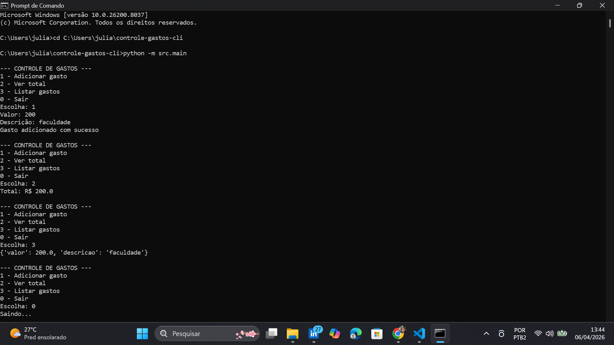
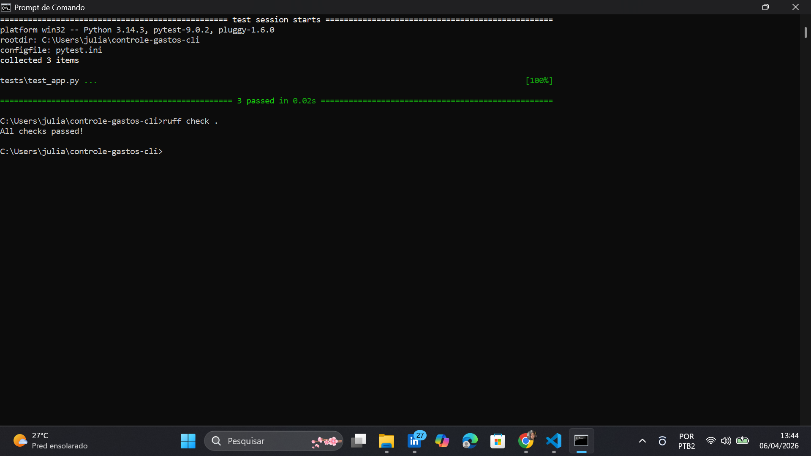

# Controle de Gastos CLI

Aplicação simples em Python para controle de gastos pessoais via linha de comando (CLI).
Permite registrar despesas e visualizar o total gasto, ajudando no controle financeiro do dia a dia.

## Demonstração

### Sistema funcionando


### Testes e qualidade de código


## Problema

Muitas pessoas têm dificuldade em controlar seus gastos diários, o que pode levar a desorganização financeira e dívidas.

---

## Solução

Este projeto oferece uma forma simples e rápida de registrar gastos diretamente pelo terminal, sem necessidade de aplicativos complexos.

---

## Funcionalidades

* Adicionar gasto
* Calcular total de gastos
* Listar gastos (opcional, se implementar)

---

## Tecnologias utilizadas

* Python 3
* Pytest (testes automatizados)
* Ruff (linting de código)
* GitHub Actions (CI)

---

## Estrutura do Projeto

```
controle-gastos-cli/
│
├── src/                # Código principal
│   ├── app.py
│   ├── main.py
|   └── __init__.py
│
├── tests/              # Testes automatizados
│   └── test_app.py
│
├── .github/workflows/  # CI (GitHub Actions)
│   └── ci.yml
|
├── assets/                # Print do código funcionando
│   ├── sistema.png
|   └── testes.png
│
├── README.md
├── requirements.txt
├── .gitignore
├── pytest.ini
├── ruff.toml
├── CHANGELOG.md
├── LICENSE
└── VERSION
```

---

## Como executar o projeto

### 1. Clonar o repositório

```
git clone https://github.com/julia12005/controle-gastos-cli.git
cd controle-gastos-cli
```

---

### 2. Criar ambiente virtual (opcional, recomendado)

```
python -m venv venv
venv\Scripts\activate   # Windows
```

---

### 3. Instalar dependências

```
pip install -r requirements.txt
```

---

### 4. Executar aplicação

```
python -m src.main
```

---

## Rodar testes

```
pytest
```

---

## Rodar lint (verificação de código)

```
ruff check .
```

---

## Integração Contínua (CI)

O projeto utiliza GitHub Actions para:

* Rodar testes automaticamente
* Verificar qualidade do código com Ruff

---

## Melhorias futuras

* Interface gráfica (GUI)
* Persistência de dados (salvar em arquivo ou banco de dados)
* Categorias de gastos
* Relatórios mensais

---

## Autora

Projeto desenvolvido por **Julia** como parte do bootcamp.

---
